  

  

    
  

  

    
    
  

  

    
    
    
    
    
    
  

---

## 👋 Hi, I'm Dangelo Vilchez

I'm an **AI-focused product engineer** who builds things end to end: the idea, the design, the code, the signed releases and the distribution. Today that means **local-first coding agents**, **cross-platform desktop apps** and **web platforms** that have to look good as well as work well.

I'm comfortable across the stack: **TypeScript, Rust, Python, Go and C++**; **Electron, SolidJS and Bun** day to day; **local models (GGUF / llama.cpp)**, **MCP** and interface design. If something has to be fast, cross-platform and offline, that's my territory.

> **Local-first** isn't a trend: if your tool needs the internet to be useful, it isn't yours.

## 🧠 What I work on

<table>
  <tr>
    <td width="33%" align="center" valign="top"><b>🤖 AI &amp; Agents</b> Local-first coding agents, GGUF inference, MCP, RAG and agentic flow design.</td>
    <td width="33%" align="center" valign="top"><b>🖥️ Desktop &amp; CLI</b> Electron, cross-platform packaging, signed installers, auto-update and publishing to Homebrew and npm.</td>
    <td width="33%" align="center" valign="top"><b>🌐 Web platforms</b> Full-stack apps, buildless static sites, API integrations and release automation.</td>
  </tr>
  <tr>
    <td width="33%" align="center" valign="top"><b>🎮 Game dev &amp; modding</b> Tooling for the <b>Dota 2</b> modding scene: <b>Mod Assistant</b> manages 1,300+ cosmetic mods, integrates the game's own assets and survives every patch.</td>
    <td width="33%" align="center" valign="top"><b>🎨 Design engineering</b> Design systems, motion, typography, performance and accessibility. The interface is part of the product.</td>
    <td width="33%" align="center" valign="top"><b>🔐 Local-first &amp; privacy</b> Software that works offline and without shipping data to third parties. The cloud is an option, never a requirement.</td>
  </tr>
</table>

## 🚀 Featured work

<table>
  <tr>
    <td width="50%" valign="top">
      <h3>⚡ <a href="https://github.com/Dreftian/Tiancode">Tiancode</a></h3>
      
<b>Local-first</b> agentic intelligence. Desktop app for Windows and a CLI for Windows, macOS and Linux: local GGUF models or whichever provider you prefer, fourteen specialists, live preview, voice and MCP.

      
<code>TypeScript</code> <code>Electron</code> <code>SolidJS</code> <code>Bun</code> <code>llama.cpp</code>

      
→ <a href="https://github.com/Dreftian/Tiancode">Repository</a> · <a href="https://tiancode.vercel.app">Web</a> · <a href="https://github.com/Dreftian/Tiancode/releases/latest">Latest release</a>

    </td>
    <td width="50%" valign="top">
      <h3>🎮 <a href="https://github.com/Dreftian/Dota2-Mods-Releases">Dota2 Mods</a></h3>
      
<b>Mod Assistant</b>, the modding tool I build for Dota 2 on Windows: <b>1,300+</b> cosmetic mods, the game's own cosmetics and Arsenal VIP with every immortal and arcana. Entirely client-side, and it never touches anyone else's match.

      
<code>Electron</code> <code>Dota 2</code> <code>Assets</code> <code>NSIS</code>

      
→ <a href="https://github.com/Dreftian/Dota2-Mods-Releases">Repository</a> · <a href="https://dota2-mods.vercel.app">Web</a> · <a href="https://github.com/Dreftian/Dota2-Mods-Releases/releases/latest">Downloads</a>

    </td>
  </tr>
  <tr>
    <td width="50%" valign="top">
      <h3>🎬 <a href="https://dreftian.github.io/youtube-4k-web/">YouTube 4K</a></h3>
      
Desktop downloader for 4K/8K and HDR with hi-fi audio and multi-connection downloads. Its distribution site is static and buildless: the version is read live from the GitHub API.

      
<code>Rust</code> <code>Tauri</code> <code>React</code> <code>yt-dlp</code> <code>ffmpeg</code>

      
→ <a href="https://dreftian.github.io/youtube-4k-web/">Site</a> · <a href="https://github.com/Dreftian/youtube-4k-releases">Installers</a>

    </td>
    <td width="50%" valign="top">
      <h3>🧰 <a href="https://github.com/Dreftian/DreftTools">DreftTools</a></h3>
      
Steam plugin installation and management platform (Steamtools, Millennium) with a premium look: one PowerShell command, script downloads and documentation access.

      
<code>HTML</code> <code>CSS</code> <code>JavaScript</code> <code>PowerShell</code>

      
→ <a href="https://github.com/Dreftian/DreftTools">Repository</a> · <a href="https://dreftools.vercel.app">Web</a>

    </td>
  </tr>
</table>

| Also | What it is |
| --- | --- |
| **[DHtraduct](https://github.com/Dreftian/DHtraduct-releases)** | AI audiovisual translation for donghuas and anime, with local transcription. Signed releases. |
| **[youtube-4k-releases](https://github.com/Dreftian/youtube-4k-releases)** | Signed release channel for Windows, Linux and macOS. |
| **[youtube-4k-web](https://github.com/Dreftian/youtube-4k-web)** | The distribution site itself: static and buildless. |

## 🧰 Stack

<table>
  <tr><td align="left" valign="middle" width="160"><b>💻 Languages</b></td>
  <td>
    
    
    
    
    
    
    
  </td></tr>
  <tr><td align="left" valign="middle"><b>🎨 Frontend</b></td>
  <td>
    
    
    
    
    
  </td></tr>
  <tr><td align="left" valign="middle"><b>⚙️ Backend</b></td>
  <td>
    
    
    
    
    
  </td></tr>
  <tr><td align="left" valign="middle"><b>🧠 AI</b></td>
  <td>
    
    
    
    
  </td></tr>
  <tr><td align="left" valign="middle"><b>🛠️ Tooling</b></td>
  <td>
    
    
    
    
    
    
    
  </td></tr>
</table>

  

## 💻 Console

  
  Demo console: this is what the tools look like in use.

## 📊 By the numbers

  

   

  <picture>
    <source media="(prefers-color-scheme: dark)" srcset="https://raw.githubusercontent.com/Dreftian/Dreftian/dist/github-contribution-grid-snake-dark.svg">
    <source media="(prefers-color-scheme: light)" srcset="https://raw.githubusercontent.com/Dreftian/Dreftian/dist/github-contribution-grid-snake.svg">
    
  </picture>

  Panel built from the GitHub API by <a href="scripts/generate-stats.py">scripts/generate-stats.py</a> · Contribution graph by Platane/snk

## 🧭 How I work

- 🎨 **Design before code.** Wireframes, design systems and interface states get decided before the first line. The UI is part of the product, not the packaging.
- 🔐 **Local-first by default.** Software should keep working offline and without shipping data to third parties. The cloud is an option, not a requirement.
- 📦 **Release quality.** Semantic versioning, changelogs, signed artifacts, automated publishing to GitHub Releases, npm and Homebrew.
- 🌱 **Sustainability over endless features.** Improving what exists, measuring the cost of every dependency and keeping the code readable beat adding another framework.

## 🎮 Off the clock

<table>
  <tr>
    <td width="50%" valign="top">
      <h3>🎮 Games</h3>
      
<b>Dota 2</b> is the usual one, and on the <b>AAA</b> side the ones that demand the tech rise to meet them: <b>Resident Evil</b>, <b>God of War</b>, <b>Devil May Cry</b> and <b>Monster Hunter</b>.

      
That is where a lot of how I write software comes from: <i>game feel</i>, frame pacing, and the idea that the interface is what makes an engine good.

      
→ <a href="https://steamcommunity.com/id/Dreftian/">Steam · Dreftian</a>

    </td>
    <td width="50%" valign="top">
      <h3>🌎 Lima, Peru</h3>
      
28, working remotely. Projects ship with documentation in Spanish and English, because software shouldn't depend on who reads it.

      
When something breaks, the first thing I do is write the problem down in a README. If I can't explain it, I don't understand it yet.

    </td>
  </tr>
</table>

## 💬 Let's talk

  
  
  

---

  Designed and built by <a href="https://github.com/Dreftian">Dreftian</a> · AI Product Engineer

