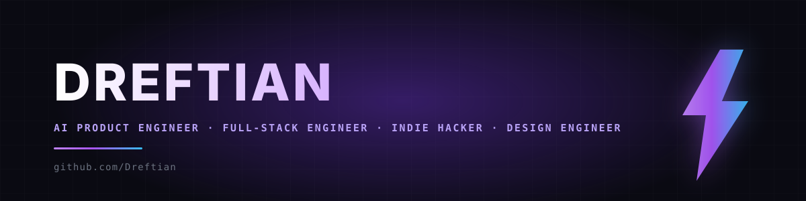

  

  

    
  

  

    
    
  

  

    
    
    
    
  

---

## Hola, soy Dangelo Vilchez 👋

Soy **ingeniero de producto enfocado en IA** y constructor de cosas de principio a fin: la idea, el diseño, el código, los releases firmados y la distribución. Hoy eso significa **agentes de programación local-first**, **apps de escritorio multiplataforma** y **plataformas web** que tienen que verse bien tanto como funcionar bien.

Me muevo cómodo en todo el stack: **TypeScript, Rust, Python, Go y C++**; **Electron, SolidJS y Bun** en el día a día; **modelos locales (GGUF / llama.cpp)**, **MCP** y diseño de interfaces. Si algo necesita ser rápido, multiplataforma y offline, es mi terreno.

>.Local-first no es una moda: si tu herramienta necesita internet para ser útil, no es tuya.

## En qué trabajo

<table>
  <tr>
    <td width="25%" align="center"><b>🤖 IA &amp; Agentes</b> Agentes de codificación local-first, inferencia GGUF, MCP, RAG y diseño de flujos agénticos.</td>
    <td width="25%" align="center"><b>🖥️ Desktop &amp; CLI</b> Electron, empaquetado multiplataforma, instaladores firmados, auto-actualización y publicación en Homebrew y npm.</td>
    <td width="25%" align="center"><b>🌐 Plataformas web</b> Aplicaciones full-stack, sitios estáticos sin build, integraciones con APIs y automatizaciones de releases.</td>
    <td width="25%" align="center"><b>🎨 Design engineering</b> Sistemas de diseño, motion, tipografía, performance y accesibilidad. La interfaz es parte del producto.</td>
  </tr>
</table>

## Proyectos destacados

<table>
  <tr>
    <td width="50%"></td>
    <td width="50%"></td>
  </tr>
  <tr>
    <td width="50%"></td>
    <td width="50%"></td>
  </tr>
</table>

| Proyecto | Qué es |
| --- | --- |
| **[Tiancode](https://github.com/Dreftian/Tiancode)** · [Web](https://tiancode.vercel.app) | Inteligencia agéntica local-first. App de escritorio para Windows y CLI para Windows, macOS y Linux. Modelos GGUF locales o el proveedor que elijas, 14 especialistas, vista previa en vivo, voz, MCP y Homebrew. |
| **[Dota2-Mods-Releases](https://github.com/Dreftian/Dota2-Mods-Releases)** · [Web](https://dota2-mods.vercel.app) | Mod Assistant para Dota 2 en Windows: catálogo de más de 1.300 mods, cosméticos del propio juego y Arsenal VIP. Releases firmados. |
| **[youtube-4k-web](https://github.com/Dreftian/youtube-4k-web)** | Sitio de distribución de YouTube 4K. Estático y sin build: la versión y las descargas se leen de la API de GitHub. |
| **[DreftTools](https://github.com/Dreftian/DreftTools)** · [Web](https://dreftools.vercel.app) | Plataforma de instalación de plugins de Steam con estética premium: un comando de PowerShell y listo. |
| **[DHtraduct](https://github.com/Dreftian/DHtraduct-releases)** | Traducción audiovisual con IA para donghuas y animes, con transcripción local. Releases firmados. |
| **[youtube-4k](https://github.com/Dreftian/youtube-4k-releases)** | Descargador de escritorio para YouTube en 4K/8K y HDR, con audio de alta fidelidad y descarga multi-conexión. |

## Stack

<table>
  <tr><td align="left" valign="middle"><b>Lenguajes</b></td>
  <td>
    
    
    
    
    
    
    
  </td></tr>
  <tr><td align="left" valign="middle"><b>Frontend</b></td>
  <td>
    
    
    
    
    
  </td></tr>
  <tr><td align="left" valign="middle"><b>Backend &amp; runtime</b></td>
  <td>
    
    
    
    
    
  </td></tr>
  <tr><td align="left" valign="middle"><b>IA</b></td>
  <td>
    
    
    
    
  </td></tr>
  <tr><td align="left" valign="middle"><b>Tooling</b></td>
  <td>
    
    
    
    
    
    
  </td></tr>
</table>

## En números

  
  

   

  

  <picture>
    <source media="(prefers-color-scheme: dark)" srcset="https://raw.githubusercontent.com/Dreftian/Dreftian/dist/github-contribution-grid-snake-dark.svg">
    <source media="(prefers-color-scheme: light)" srcset="https://raw.githubusercontent.com/Dreftian/Dreftian/dist/github-contribution-grid-snake.svg">
    
  </picture>

## Cómo trabajo

- **Diseño antes que código.** Wireframes, sistema de diseño y estados de interfaz se deciden antes de la primera línea. La UI es parte del producto, no el envase.
- **Local-first por defecto.** El software debe seguir funcionando sin conexión y sin enviar datos a terceros. La nube es una opción, no un requisito.
- **Calidad de release.** Versionado semántico, changelogs, artefactos firmados, publicación automatizada en GitHub Releases, npm y Homebrew.
- **Sostenibilidad antes que features infinitas.** Mejorar lo que existe, medir el coste de cada dependencia y mantener el código legible valen más que añadir otro framework.

## Hablemos

  
  
  

---

  Hecho con  por <b>Dreftian</b>

